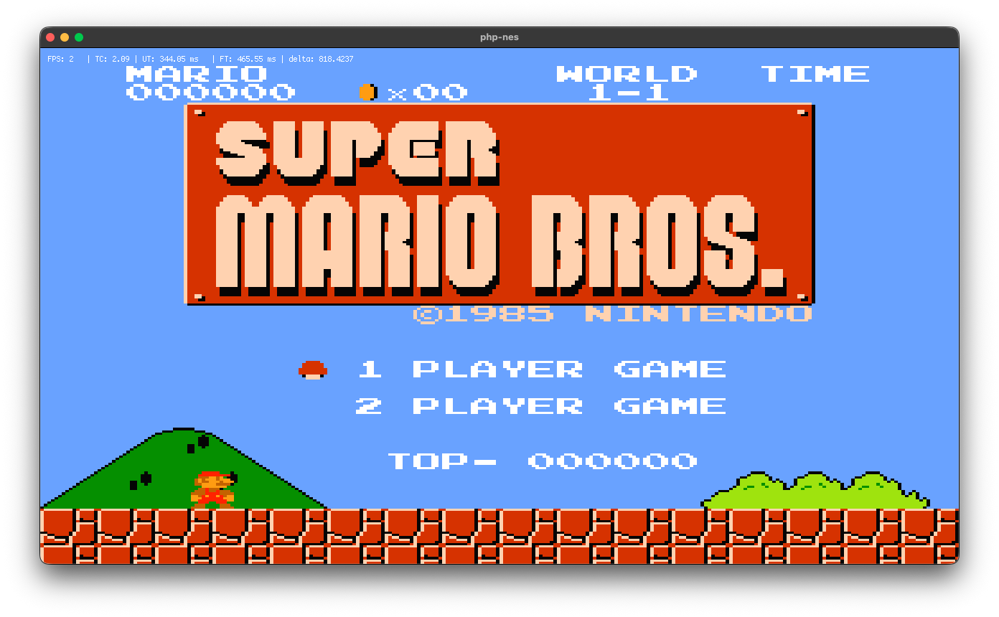

# php-nes: NES Emulator in PHP with PHP-GLFW and VISU

[](https://github.com/oliverearl/nes-php-glfw/actions/workflows/tests.yml)
[](https://github.com/oliverearl/nes-php-glfw/actions/workflows/static-analysis.yml)
[](https://github.com/oliverearl/nes-php-glfw/actions/workflows/code-style.yml)
[](https://www.php.net/)
[](LICENSE)

A cycle-accurate Nintendo Entertainment System (NES) emulator written in PHP, implementing the 6502 CPU and PPU. It makes use of the PHP-GLFW 
extension for OpenGL graphics rendering via the VISU framework.



## About

This is a technical demonstration project showcasing low-level emulation techniques in PHP. The emulator prioritises accuracy over performance, 
implementing cycle-accurate CPU execution and proper PPU timing for authentic NES behaviour.

**This is a technical demo.** Do not expect high performance or production-ready gameplay. The project is intended for educational purposes and as a 
proof-of-concept for emulation in PHP.

## Requirements

- **PHP 8.5** (required - no earlier versions supported)
- **PHP-GLFW extension** (for graphics rendering via OpenGL)
- **Composer** (for dependency management)

### Critical Performance Note

**Disable Xdebug for acceptable performance.** Running the emulator with Xdebug enabled will result in extremely poor performance. Ensure Xdebug is 
disabled when running the emulator:

```bash
php -d xdebug.mode=off bin/start.php path/to/rom.nes
```

Or disable it in your `php.ini`:

```ini
xdebug.mode=off
```

## Installation

1. Clone the repository:
```bash
git clone https://github.com/oliverearl/nes-php-glfw.git
cd nes-emulator
```

2. Install dependencies:
```bash
composer install
```

3. Ensure PHP-GLFW extension is installed and enabled.

For more information on getting this installed on your platform, refer to 
[their website](https://phpgl.net/getting-started/getting-started-with-php-and-opengl.html) for easy instructions.

## Usage

Run the emulator with a NES ROM file:

```bash
php bin/start.php path/to/rom.nes
```

If you don't start the emulator with a loaded ROM, it will display a graphical pattern. You
can also drag and drop a ROM file onto the window to load it.

### Profiler

Enable performance debugging to see detailed timing metrics by passing the `--profile` flag:

```bash
php bin/start.php path/to/rom.nes --profile
```

This will output performance statistics every second to `stderr`, showing:
- Average time spent in update/draw cycles
- CPU, PPU, and rendering breakdown
- NES frames per second
- Iterations per update

Example debug output:
```
[NES Debug] Updates: 28 (avg 35.61ms) | Draws: 3 (avg 0.95ms) | NES frames: 28 | Iters/update: 9696
[NES Debug] Breakdown: CPU 13.80ms | PPU 5.63ms | Render 14.02ms (per update avg)
```

### Controls

- Arrow Keys: D-Pad
- Z: A Button
- X: B Button
- Enter: Start
- Backspace: Select

## Features

### Implemented

- **6502 CPU Emulation**
  - Official and unofficial opcodes
  - Cycle-accurate execution
  - Interrupt handling (NMI, IRQ)

- **PPU (Picture Processing Unit)**
  - Background rendering
  - Sprite rendering with priority
  - Proper VRAM and palette management
  - VBlank timing and interrupts

- **Memory Subsystem**
  - Accurate RAM mirroring
  - Memory-mapped I/O
  - Direct Memory Access (DMA)

- **Input Handling**
  - Keyboard controls via VISU framework
  - Proper controller polling

- **Graphics**
  - OpenGL rendering via PHP-GLFW
  - Authentic NES colour palette
  - 256x224 resolution output

### Not Yet Implemented

- Audio Processing Unit (APU)
- Mapper support beyond NROM (Mapper 0)
- Save states
- Controller configuration
- Performance optimisations

## Architecture

The emulator is structured around the actual NES hardware architecture:

- `src/Cpu/` - 6502 CPU implementation
- `src/Graphics/` - PPU and rendering pipeline
- `src/Bus/` - Memory buses and addressing
- `src/Cartridge/` - ROM loading and cartridge emulation
- `src/Input/` - Controller input handling

## Testing

The project includes comprehensive test coverage with PHPUnit:

```bash
# Run all tests
composer test

# Run with coverage
composer test:coverage

# Run static analysis
composer phpstan

# Check code style
composer pint
```

## Development

This project follows strict code quality standards:

- **PHPStan** for static analysis
- **Laravel Pint** for code formatting (PER)
- **PHPUnit** for comprehensive testing (234+ tests, 266,000+ assertions)

AI-assisted development guidelines are available for Claude, Copilot/Codex, JetBrains Junie, and Cursor.

## Technical Details

### Timing

- CPU: ~1.79 MHz (NTSC)
- PPU: 3x CPU speed
- Frame rate: ~60 FPS (262 scanlines per frame)

### Memory Map

- CPU Address Space: $0000-$FFFF
  - $0000-$07FF: 2KB internal RAM (mirrored)
  - $2000-$2007: PPU registers (mirrored)
  - $4000-$4017: APU and I/O registers
  - $8000-$FFFF: Cartridge ROM space

- PPU Address Space: $0000-$3FFF
  - $0000-$1FFF: Pattern tables
  - $2000-$2FFF: Nametables
  - $3F00-$3F1F: Palette RAM

## Resources

- [NES Dev Wiki](https://wiki.nesdev.com/)
- [6502 Reference](http://www.6502.org/)
- [PPU Documentation](https://wiki.nesdev.com/w/index.php/PPU)

## License

This project is open source. See the [LICENSE](LICENSE) file for details.

## Acknowledgments

Built with the [VISU framework](https://github.com/phpgl/visu) for graphics rendering and the [PHP-GLFW](https://phpgl.net/) extension for OpenGL 
bindings.

Inspiration and PHP reference was drawn from various PHP emulation projects, including:
- [This incredibly impressive Chip8 emulator using Visu and PHP-GLFW](https://github.com/mario-deluna/php-chip8)
- [A PHP emulator that renders to the terminal](https://github.com/hasegawa-tomoki/php-terminal-nes-emulator)
- [A similar Game Boy emulator that also renders to the terminal]()https://github.com/gabrielrcouto/php-terminal-gameboy-emulator)
- [A Hello World ROM that is used as as test fixture](https://github.com/thomaslantern/nes-hello-world)

Nintendo, NES, Super Mario Bros, and related logos are trademarks of Nintendo. This project is not affiliated with or endorsed by Nintendo.
All trademarks and copyrights are the property of their respective owners.

**Do not distribute copyrighted ROMs!**

---

**Note:** This is a technical demonstration project. The focus is on accuracy and educational value, not on performance or completeness. 
Contributions and feedback are welcome.

